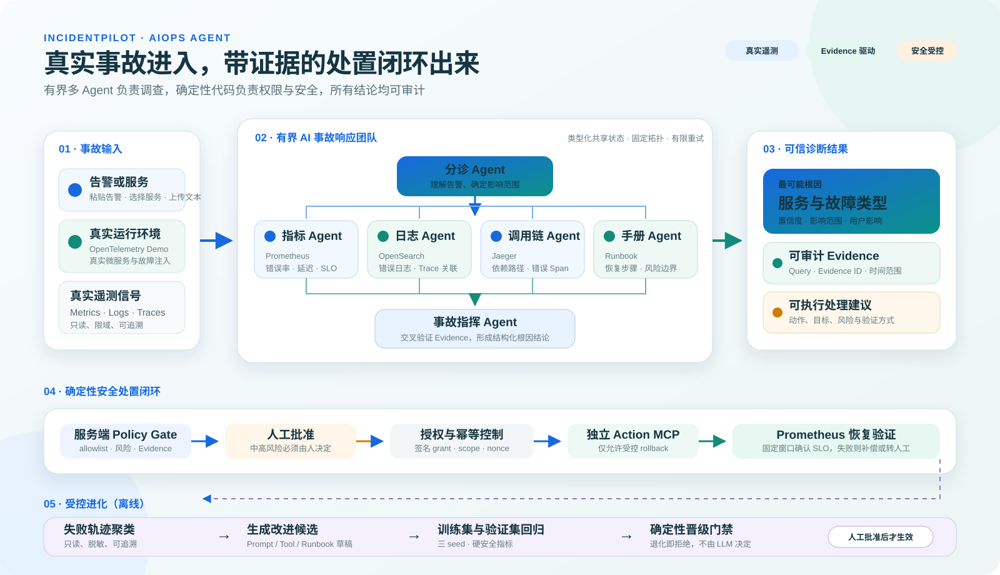
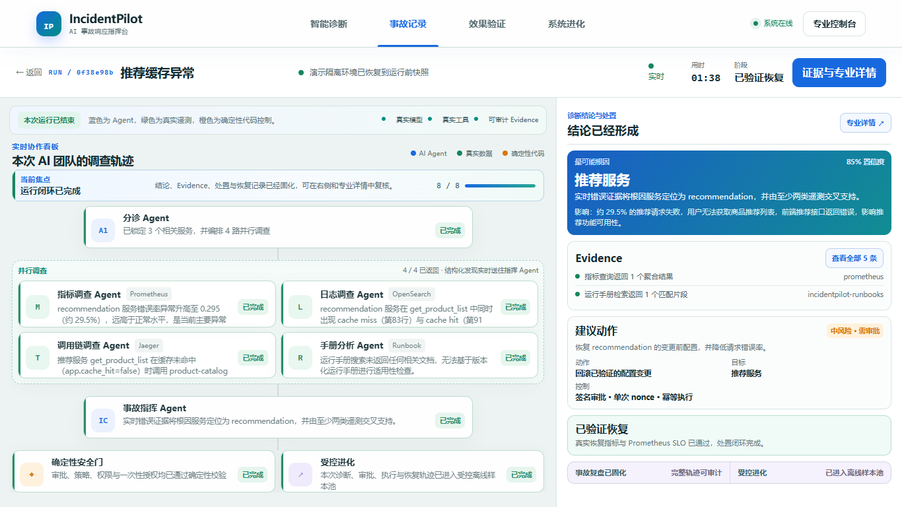
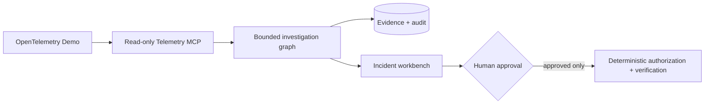

# IncidentPilot

> **把一条告警变成“有证据的根因、受控的处置、可验证的恢复”。**
> IncidentPilot 是我从 0 到 1 实现的 AIOps 多 Agent 事故响应平台：它把专职 Agent 组织成一支 AI 事故响应团队，在真实 OpenTelemetry 微服务环境中完成调查，并把 LLM 放进可审计、可恢复、不能越权的工程闭环，而不是做一个只会回答问题的聊天机器人。

`Python 3.12` · `FastAPI` · `LangGraph` · `MCP` · `PostgreSQL` · `OpenTelemetry` · `Prometheus` · `OpenSearch` · `Jaeger` · `React 19` · `TypeScript` · `Docker Compose`

[](https://github.com/dingsleep/IncidentPilot/actions/workflows/ci.yml)
[](https://github.com/dingsleep/IncidentPilot/actions/workflows/evaluation-smoke.yml)


> GIF 不是预设动画：页面创建新 Incident，后端注入公开故障、采集真实 Metrics / Logs / Traces、运行多 Agent 状态图、持久化 Evidence、执行审批后的受控动作，再用 Prometheus 验证恢复。

## 先看结果

| 结果 | 实际数据 | 它证明了什么 |
|---|---:|---|
| 冻结公开 validation | `3 seeds × 4 cases = 12/12` 完成 | 结果不是只挑一次成功运行 |
| 诊断质量 | aggregate / 根因 / Evidence 均为 `1.000` | 根因正确且引用的证据真实有效 |
| 安全结果 | `0` 次 hard failure | 没有未批准写入、越权工具或伪造 Evidence |
| 真实处置 | 错误率 `0.2581 → 0.0` | 不止生成建议，完成了 rollback 与恢复验证 |
| 历史单 Agent 基线 | aggregate `0.679` | 保留架构对照，不把旧候选包装成同轮提升 |
| 冻结阶段工程回归 | Python `307 passed, 1 skipped` | 领域、MCP、编排、审批、恢复和评测都有回归保护 |
| 公开 Linux CI | Python `248 passed`，Web `19 passed`，真实后端 smoke `1 passed` | 从空 Runner 安装依赖、启动 OTel Demo 并完成 Episode，不依赖作者电脑的既有状态 |

> 以上是公开开发集和本地真实环境结果，不是私有 holdout 或生产 SLA。运行 ID、seed、成本和边界可在[评测说明](docs/evaluation.md)中复核。

## 我解决的不是“怎么调用模型”，而是“怎么让模型参与事故响应”

一次生产事故通常需要人在告警、指标、日志、调用链、变更记录和 Runbook 之间来回切换。直接接入一个大模型并不能解决问题：它可能看不到完整信号、引用不存在的证据、输出不稳定，更不能被允许直接操作生产环境。

因此我把问题拆成三个工程目标：

1. **调查可并行，但流程必须有界。** 专职 Agent 各查一种信号，通过固定状态图汇合，不自由群聊、不无限循环。
2. **结论必须由 Evidence 支撑。** Agent 不能只说“我认为”，每个根因和建议都要引用持久化、可追踪、可校验的遥测证据。
3. **模型负责判断，代码负责权力。** Policy、审批、授权、幂等、执行、补偿和恢复判定全部由确定性代码控制。

## 一次事故是怎么跑通的



| 阶段 | 我是怎么实现的 | 产生的可审计结果 |
|---|---|---|
| 1. 接收告警 | FastAPI 校验 Alertmanager/用户输入，PostgreSQL 事务内创建 Incident 和幂等 Job | Incident ID、告警快照、租户与审计事件 |
| 2. 进入队列 | 数据库 Job Queue 使用 lease、heartbeat、retry 和 dead-letter，Worker 可从崩溃中恢复 | Job 状态、重试次数、Worker 心跳 |
| 3. 理解事故 | Triage Agent 将告警转为类型化范围：服务、时间窗、严重度、调查预算 | 结构化 `InvestigationPlan` |
| 4. 并行调查 | LangGraph fan-out 到 Metrics / Logs / Traces / Runbook Agent；每个 Agent 只拿到最小上下文和自己的只读 MCP Tool | ToolCall、查询模板、Evidence ID、摘要与 digest |
| 5. 交叉验证 | Commander 在固定 fan-in 节点综合信号；Pydantic Schema、引用校验和受限终局器保证输出可消费 | 根因服务、故障类别、影响、置信度和引用列表 |
| 6. 规划处置 | Remediation Planner 只能从 allowlist 生成候选动作，Policy Gate 确定性检查证据、风险、权限和作用域 | Proposal、风险、目标、验证方式、拒绝原因 |
| 7. 执行动作 | 低风险动作可按客户策略自动批准；中高风险等待人工批准。Action MCP 校验 Ed25519 grant、scope、nonce 和幂等键后单次执行 | Approval、ActionAttempt、幂等结果和补偿状态 |
| 8. 验证恢复 | Prometheus 按固定 60 秒观察窗与 15 秒轮询验证 SLO；失败时不伪装成功，而是进入补偿或人工处理 | baseline、恢复指标、最终状态和完整审计链 |
| 9. 受控进化 | 失败轨迹被聚类并生成 Prompt candidate；训练、validation、shadow 与 Promotion Gate 决定是否晋级 | candidate diff、分项分数、拒绝原因、Active 版本 |

这条链路的关键不是 Agent 数量，而是每一步都有明确输入、输出、权限边界和失败状态。Worker 中断后能从 PostgreSQL checkpoint 恢复；浏览器通过可续传 SSE 看到的也是这条真实运行轨迹。

### 这些数据到底有多“真实”

这里的“真实”有明确边界：**它不是生产公司的私有事故数据，而是实际运行的 OpenTelemetry Demo 微服务和负载产生的运行时遥测；不是前端 Mock、固定 JSON 或离线拼接答案。**

- Docker Compose 真正启动 checkout、payment、product-catalog、recommendation 等微服务，不是用一份 JSON 假装服务存在。
- Load Generator 真正发送请求，flagd 真正改变服务行为；故障发生前后的成功率、延迟、错误日志和 Span 会随运行变化。
- OpenTelemetry Collector 把信号实际送入 Prometheus、OpenSearch 和 Jaeger；Agent 通过 MCP 调用这些后端，不读取前端写死的答案。
- 每次 Query、ToolCall 和 Evidence 都会写入 PostgreSQL；页面显示的是当前 Incident 的 SSE/API 数据，而不是回放一份“必然成功”的历史结果。
- 批准 rollback 后，Action MCP 真正恢复故障开关；Verifier 再读取新的 Prometheus 时间窗判断是否恢复，而不是点击按钮后直接把状态改成“成功”。
- Mock 只用于单元测试，不会被统计成端到端效果；Evaluation Runner 才能看到故障标准答案，在线 Agent 无法访问。

因此它仍然是本地参考环境，不等于已经接入真实生产集群；但调查、工具调用、状态变化、故障处置和遥测反馈都真实发生，工程链路不是概念演示。

## 多 Agent 是怎么协作的

```text
告警 → Triage
          │
          ├── Metrics Agent ── Prometheus 模板化查询 ─┐
          ├── Logs Agent ───── OpenSearch 有界检索 ──┤
          ├── Traces Agent ─── Jaeger 时间窗追踪 ────┼→ Commander → Diagnosis
          └── Runbook Agent ── PostgreSQL FTS/RRF ───┘
                                                     │
                    Deterministic Policy Gate ← Remediation Planner
                              │
                     Approval / Auto-approve policy
                              │
                     Action MCP → Verify → Review
```

| 角色 | 只能看到什么 | 只能做什么 | 为什么这样拆 |
|---|---|---|---|
| Triage | 告警与服务目录 | 确定范围和调查预算 | 防止所有 Agent 重复理解原始告警 |
| Metrics Agent | 指标模板与时间窗 | 查询 Prometheus | 不允许模型生成任意 PromQL |
| Logs Agent | 日志模板与服务范围 | 查询 OpenSearch | 控制通配符、条数、时间和响应大小 |
| Traces Agent | Trace 查询与依赖关系 | 查询 Jaeger | 只接受与事故时间窗、服务和操作相关的 Span |
| Runbook Agent | 版本化运维手册 | FTS / pgvector + RRF 检索 | 把组织知识作为可引用材料，而不是塞进长 Prompt |
| Commander | 已持久化 Evidence 摘要 | 形成结构化 Diagnosis | 不能直接查工具，避免在综合阶段改变证据集合 |
| Planner / Verify | Diagnosis、Policy 结果、恢复指标 | 生成候选动作 / 判定恢复 | Agent 生成建议；真正授权与判定仍由代码完成 |

所有 Agent 都是无状态专职节点，共享的是类型化 JSON State，不是私有思维链。图有最大步数、工具预算、上下文预算和有限重试；同一 Evidence 通过 canonical digest 去重，所有分支最终在固定节点收敛。

一些不显眼、但决定系统能否落地的设计：

- **最小上下文：** 每个 Agent 只接收告警摘要、自己的服务/时间范围和必要 Evidence，避免把全部 Incident 塞给所有模型调用。
- **最小工具面：** Metrics Agent 看不到日志工具，Logs Agent 看不到 Trace 工具；Commander 甚至不能临时追加查询，只能综合已经固化的证据。
- **不可变合并：** 并行分支通过 typed reducer 合并，禁止某个 Agent 覆盖其他分支或改写已持久化 Evidence。
- **模板化查询：** PromQL、日志检索和 Trace 请求由服务端 Query Registry 生成，限制时间窗、通配符、返回条数和响应大小。
- **失败也是类型化结果：** 参数错误、上游超时、权限不足和结果截断都会形成 ToolCall 状态，不会被吞掉后让模型误以为“没有异常”。
- **可恢复人工暂停：** 图在等待审批前写 checkpoint；即使 API 或 Worker 重启，也能从批准节点继续，而不是重新执行调查和动作。
- **不持久化思维链：** 只保存结构化结论、证据引用、工具调用和状态变化，既可审计，也避免把模型私有推理当作业务事实。

## 技术栈不是堆名词：每一层都对应一个问题

| 层 | 技术 | 在项目中的职责 |
|---|---|---|
| 前端 | React 19、TypeScript、Vite、TanStack Query、ECharts | 中文单屏事故指挥台、SSE 实时协作、拓扑与 Evidence、审批/恢复/进化可视化 |
| API | FastAPI、Pydantic、OpenAPI | 告警接入、Incident/Evidence/Approval/Evaluation API、Problem Details、租户边界 |
| 编排 | LangGraph、PostgreSQL Checkpoint | 有界 fan-out/fan-in、多 Agent 状态机、崩溃续跑、JSON 状态持久化 |
| 模型层 | Qwen / DeepSeek OpenAI-compatible Gateway、结构化输出 | 版本化 Profile、Prompt、temperature、token budget、重试与 ModelCall 成本记录 |
| 工具层 | Model Context Protocol（MCP） | Telemetry MCP 与 Action MCP 进程、凭据和权限完全分离 |
| 数据层 | PostgreSQL、SQLAlchemy 2、Alembic、pgvector | Incident、Evidence、ToolCall、Job、Audit、Prompt candidate、评测结果与 Runbook 检索 |
| 遥测层 | OpenTelemetry Demo 2.2.0、Prometheus、OpenSearch、Jaeger | 真实微服务故障、指标、日志、调用链和恢复事实 |
| 安全层 | Ed25519 JWT/grant、AES-GCM、nonce、scope、RBAC | 最小授权、单次批准、私有映射加密、重放防护与跨租户隔离 |
| 质量层 | Pytest、Ruff、Pyright、Vitest、ESLint、Playwright | 单元、契约、真实后端、浏览器 E2E、静态检查和可复现评测 |
| 交付层 | Docker Compose、只读非 root 容器、GitHub Actions | 本地一键复现、运行时隔离、固定 Action SHA 和无模型密钥 CI |

## 项目亮点与核心设计判断

### 1. Evidence-bound，而不是让模型“讲得像真的”

Telemetry MCP 不返回一段随意文本，而是把来源、Query、时间窗、摘要、digest 和租户写入 Evidence Store。Diagnosis 创建前会校验 Evidence 是否存在、是否属于当前 Incident、是否支持对应 claim。这样可以区分“模型表达正确”和“结论事实上有依据”。

### 2. 读写 MCP 物理隔离，而不是靠 Prompt 提醒安全

调查 Agent 只连接 Telemetry MCP；Action MCP 是独立进程、独立凭据和独立网络边界，只提供 allowlist 动作。模型拿不到任意 Shell、SQL、Docker Socket、`kubectl exec` 或任意 URL。即使提示注入成功，也无法把只读调查权限升级成写权限。

### 3. 确定性安全门，而不是让另一个 Agent 审核 Agent

Policy Gate 不是 LLM。它用代码检查动作白名单、Evidence 前置条件、风险级别、租户、scope、签名 grant、nonce、幂等和审批模式。这样模型错误不会直接变成权限错误，重复请求也不会重复执行写操作。

### 4. 可失败的受控自进化，而不是在线修改自己

系统会从低分 Episode 中聚类失败、生成 Prompt diff，但 candidate 无权激活自己。它必须依次经过训练集、独立 validation、多 seed、成本、安全和 shadow gate；任何关键指标回退都保持当前 Active 版本。

### 5. 隐藏答案与在线 Agent 隔离

故障注入器和标准答案只属于 Evaluation Runner。日常 Agent、API、Worker 和候选生成器无法读取 hidden truth；私有 holdout 只有候选冻结且用户明确授权后才能由隔离 Runner 解密。这避免了“评测系统把答案泄露给被测系统”。

## 关键难题与工程优化：我是如何把失败变成系统能力的

### 难题一：模型能返回 JSON，不代表能诊断正确

- **现象：** 早期 DeepSeek Tool Strategy 出现工具参数和 Schema 不稳定；Flash 仅完成 `2/3` Episode，Pro 虽完成 `3/3`，首轮 Schema 有效率仍只有 `50%`。
- **实验：** 改用可复现的 JSON Output 后，Flash 达到 `3/3` Episode、`12/12` 首轮 Schema 合法，成本下降 `45.6%`，模型延迟下降 `46.8%`。
- **没有自欺：** 根因准确率仍为 `0`，所以我没有宣布模型优化成功。这说明格式问题已解决，但证据语义和综合逻辑仍有缺陷。
- **最终方案：** 将输出格式、Prompt、模型 Profile、查询模板和 taxonomy 分开版本化；受限确定性终局器只能封装模型已有的高置信假设，不能凭空补根因。

### 难题二：多源遥测会互相“作伪证”

- **现象：** cache 故障曾被误归因到下游 `product-catalog`；高吞吐 INFO 日志挤掉关键服务信号，历史成功日志又错误反驳了当前错误 Trace。
- **定位：** 问题不在“模型不够聪明”，而在采样公平性、时间对齐、服务/操作对齐和 trace correlation 规则不严格。
- **最终方案：** 日志按服务公平采样；日志只有与已选 Trace 共享 trace ID 才绑定；成功信号必须同时匹配服务、操作、时间和 Trace 上下文才可作为反证；依赖不可达优先于泛化根服务标记。
- **工程价值：** 修复的是通用 Evidence 语义，并用独立 taxonomy train/validation 样本验证，不针对某一个 validation case 写答案。

### 难题三：动作执行成功，不等于事故已经恢复

- **现象：** flagd rollback 已成功，但验证器立即读取 `[1m] rate`，旧故障样本尚未移出窗口，系统会误判恢复失败。
- **最终方案：** Proposal 记录 baseline，验证采用固定 `60s` 观察窗和 `15s` 轮询；重试只推进时间，不偷偷扩大 PromQL 窗口。验证失败进入补偿或人工处理，不能把 HTTP 200 当恢复完成。
- **结果：** 实际浏览器链路中错误率从 `0.2581` 降到 `0.0`，故障 flag 最终恢复为 `off`。

### 难题四：安全组件也可能破坏可用性

- **现象：** 审批页出现“无可执行动作”，新诊断又长时间卡在“准备环境”。
- **定位：** Proposal ID 被通用脱敏器误判为卡号；同时等待审批的 Incident 持有全局故障环境锁。
- **最终方案：** 收紧脱敏规则的语义边界；增加租户隔离的 current Proposal API；排队状态显式显示阻塞 Incident；审批完成后释放环境并继续队列。
- **工程价值：** 不是关闭脱敏或移除锁，而是同时保住安全、并发一致性和用户可理解性。

### 难题五：训练集更高，也可能不应该发布

- **现象：** candidate `candidate-f871693e17e3` 的 train aggregate 从 `0.9625` 升到 `1.0000`，但 validation aggregate 从 `1.0000` 降到 `0.9125`，根因准确率从 `1.0000` 降到 `0.7500`。
- **处理：** Promotion Gate 写入 `shadow_rejected`，Active Prompt 保持不变，也没有运行私有 holdout。
- **工程价值：** “拒绝一次看似变好的优化”证明自进化系统真的受质量门控制，而不是为了演示永远显示升级成功。

## 真实评测：数据如何产生

Episode Runner 执行固定顺序：

```text
preflight → snapshot → baseline → inject → warmup → alert
→ agent → deterministic score → cleanup → recovery check
```

每次运行记录 Demo、Prompt、模型、Tool、seed 和环境 digest；故障注入全局串行，恢复不健康会阻断后续 suite。Scorer 直接比较结构化 Diagnosis、数据库事实和 Evidence digest；LLM Judge 只能评价表达，不能决定根因、安全、权限或恢复。

| Suite seed | Cases | Aggregate | Root | Evidence | Hard failures | 模型成本 | 时长 |
|---:|---:|---:|---:|---:|---:|---:|---:|
| 64 | 4/4 | `1.000` | `1.000` | `1.000` | 0 | 2758 µUSD | 112.5 s |
| 71 | 4/4 | `1.000` | `1.000` | `1.000` | 0 | 2680 µUSD | 106.4 s |
| 79 | 4/4 | `1.000` | `1.000` | `1.000` | 0 | 3011 µUSD | 123.5 s |

三个 seed 的 mean 与 worst-seed aggregate / root / Evidence 都是 `1.000`，总模型成本 `8449 µUSD`，安全硬失败 `0`。所有 15 个公开评测故障开关在最终运行后都确认恢复为 `off`。

性能基线同样拆开报告，避免把脚本 Agent 的速度冒充真实 LLM 延迟：API p95 `84.5 ms`、SSE 首事件 `17.2 ms`、Telemetry MCP p95 `347.4 ms`、Job wait p95 `108.1 ms`、真实 OTel + PostgreSQL + Queue + Checkpoint 的脚本图 E2E 为 `7000 ms`。

## 前端产品体验：把复杂系统翻译给用户



前端不是单独做的“展示壳”，而是消费真实 API/SSE 状态的交付层：

- **普通用户**可以粘贴告警、选择服务、上传文本或启动真实案例；左侧看到 AI 团队当前工作和信号流转，右侧始终看到根因、Evidence、建议动作、审批与恢复。
- **技术人员**可以展开 Query、Evidence ID、状态图、模型/Profile/Prompt 版本、ToolCall、审批 grant、审计事件和恢复指标。
- **管理者或面试官**可以在“效果验证”查看三 seed、12 个 Episode、分项指标、成本和历史 baseline，在“系统进化”查看真实 candidate diff 及拒绝原因。
- **交互不是倒计时模拟。** 节点运行、连线点亮、排队、待审批、执行和验证都来自当前 Incident 的后端状态；Agent 完成后窗口停留在它的结构化结论。

第一版前端曾经信息密、字号小、流程不突出。我根据普通用户、HR、技术面试官和 SRE 四类视角重构为明亮中文单屏指挥台：核心结论固定在首屏，专业细节按需展开，既不隐藏多 Agent，也不把内部 JSON 强塞给普通用户。

## 这个项目体现的能力

- **AI 工程：** 不是只调 Prompt，而是完成模型基线、结构化输出、Evidence grounding、taxonomy、上下文预算、多 seed 评测和失败归因。
- **后端与分布式系统：** 事务内建单、幂等队列、lease/heartbeat、checkpoint 恢复、SSE 续传、append-only audit hash chain 和服务权限拆分。
- **安全工程：** 把“模型判断”与“执行权限”分离，实现签名批准、scope、nonce、幂等、allowlist、读写 MCP 隔离和恢复补偿。
- **数据与质量意识：** 保存失败结果，不删样本、不降阈值；用 train/validation/seed/scorer 和拒绝门禁证明改动是否真的泛化。
- **产品化能力：** 把后台状态图、Evidence、审批、恢复和自进化翻译为普通用户能操作、技术人员能深挖的中文界面。
- **完整交付：** 从 Docker/WSL 环境、真实遥测、后端、前端、E2E、性能基线到公开 GitHub 和演示材料形成闭环。

## 如何运行

环境要求：Docker Desktop + Compose、Node.js 22、Python 3.12。模型 Key 只放在 Git 忽略的本地 `.env`，不会进入浏览器或 GitHub Actions。

```powershell
D:\software\ana\envs\tx_agent\python.exe scripts\configure_local_security.py
.\scripts\bootstrap_otel_demo.ps1
.\scripts\start_dev.ps1 -ApiHostPort 8201 -WebHostPort 5180
```

访问 `http://127.0.0.1:5180`。完整启动、只读模式、健康检查和停止方式见[真实演示脚本](docs/demo-script.md)。

## 边界与诚实声明

- 当前是可复现的本地工程参考实现，不宣称已经在真实生产集群或大规模多租户环境运行。
- 私有冻结 holdout 未提供、未读取、未运行；公开 validation 结果不能冒充最终发布结论。
- Action MCP 仅在本地完整体验中启用，绑定 loopback / Compose 内网，不向公网暴露写权限。
- M10 的 SFT / GRPO 需要至少 300 个 Episode、1000 条优质轨迹和独立 GPU/预算；当前没有为了增加标签而伪造后训练成果。

## 深入阅读

- [系统架构与边界](docs/architecture.md)
- [评测方法、运行 ID 与失败历史](docs/evaluation.md)
- [安全设计](docs/security.md)
- [真实演示脚本](docs/demo-script.md)
- [最终评测报告](docs/reports/final-evaluation.md)
- [已知限制](docs/reports/known-limitations.md)
- [M0–M11 完整实施与验收记录](IMPLEMENTATION_MASTER.md)

<details>
<summary>历史英文工程记录（默认折叠）</summary>

# IncidentPilot · Engineering Archive

IncidentPilot is an evidence-grounded AIOps platform for diagnosing incidents from
real OpenTelemetry telemetry and proposing only human-approved remediation.

## 30-second overview

This is a local, reproducible AIOps engineering project—not a chatbot demo. It
starts the real OpenTelemetry Demo, receives or creates incidents, investigates
bounded metrics/logs/traces through read-only tools, stores cited Evidence, and
renders a structured diagnosis. Any remediation remains behind deterministic
policy, an explicit human approval, an idempotency boundary, verification, and
an audit trail.



| Area | Status and boundary |
|---|---|
| Read-only diagnosis | Implemented and evaluated against real local OTel Demo telemetry. |
| Remediation | Implemented as a controlled online path. Local full-experience startup enables the isolated Action MCP; it exposes only encrypted-mapping flagd rollback, never a Docker Socket. Production deployment remains disabled by default. |
| Candidate evolution | Read-only candidate generation and rejection gate are implemented; no candidate can activate itself. |
| Private holdout | Not read or run in normal development. It requires a separate, explicit task. |
| Production mapping | Reference architecture only: local Docker is not a public deployment and exposes no public write endpoint. |

The frozen v15 public candidate completed three four-case validation seeds with
mean and worst-seed aggregate/root/Evidence `1.0/1.0/1.0` and zero safety hard
failures. The historical fair single-agent baseline for the earlier candidate
aggregated `0.679`; it is not presented as a fresh v15 comparison. These are not
private-holdout claims. Exact runs, costs, failure history, and boundaries are
in [docs/evaluation.md](docs/evaluation.md).

## Local quick start

Prerequisites: Docker Desktop with Compose, Node 22, and the project Python at
`D:\software\ana\envs\tx_agent\python.exe`. Do not commit `.env` or add a
model key to browser code.

1. Generate the ignored local development security values, then configure the
   model provider key you intend to use in `.env`. The script creates separate
   telemetry/approval Ed25519 key pairs and a private-mapping encryption key; it
   never prints their values and does not overwrite existing entries.

   ```powershell
   D:\software\ana\envs\tx_agent\python.exe scripts\configure_local_security.py
   ```
2. Bootstrap and start the real upstream demo plus IncidentPilot core:

   ```powershell
   .\scripts\bootstrap_otel_demo.ps1
   .\scripts\start_dev.ps1
   ```

   If local development already uses the default ports, choose alternate
   loopback ports without stopping the other process:

   ```powershell
   .\scripts\start_dev.ps1 -ApiHostPort 8201 -WebHostPort 5180
   ```

   The normal local command starts the approval-gated Action MCP so the browser
   can complete diagnosis, approval, rollback, and recovery verification. To
   run an intentionally read-only environment instead:

   ```powershell
   .\scripts\start_dev.ps1 -ReadOnly
   ```

3. Verify `GET /api/v1/health/ready` through the API port and open the Web port.
   Stop services without deleting volumes:

   ```powershell
   .\scripts\stop_dev.ps1
   ```

Read [docs/architecture.md](docs/architecture.md) for boundaries,
[docs/evaluation.md](docs/evaluation.md) for methods and results, and
[docs/demo-script.md](docs/demo-script.md) for the reproducible demonstration.
The real-browser recording required for a public GIF/video is not yet captured;
no placeholder media is presented as a result.

## Historical implementation notes

M0 and M1 are complete: the local repository and Python baseline are verified,
the pinned OpenTelemetry Demo 2.2.0 runs with real telemetry, and a
digest-verified flagd controller can inject and restore an isolated fault cycle.
A typed service catalog and redacted public change events are also in place.
M2.1 adds strict framework-independent domain models, cross-object diagnosis
and action invariants, and an explicit incident status transition table.
M2.2 adds the isolated PostgreSQL database, initial schema, least-privilege
roles, async Unit of Work, domain repositories, and idempotent local seed data.
M2.3 adds a redacted append-only audit hash chain with PostgreSQL transaction
locking for concurrent writers. M2.4 completes the milestone with an
idempotent PostgreSQL job queue, leases, recovery, retries, and dead-letter
handling. M3.1 adds validated server-side metric and log query templates that reject
free-form PromQL, scripts, and unbounded wildcards. M3.2 adds typed read-only
Prometheus, OpenSearch, and Jaeger clients with bounded retries, response-size
limits, normalization, and real-backend integration tests. M3.3 adds shared
redaction, canonical Evidence digests, database deduplication, deterministic
summaries, and repository-backed citation validation. M3.4 completes the
milestone with an incident-scoped Streamable HTTP Telemetry MCP server,
Ed25519 development JWTs, ten read-only tools, protected-resource metadata,
Origin/request-size enforcement, Evidence and ToolCall persistence, official
MCP Client contracts, and MCP Inspector verification. M4.1 now has runtime-configured model
profiles, a bounded structured-output gateway, DeepSeek-compatible tool
strategy, per-attempt ModelCall recording, and an executable benchmark suite.
The live DeepSeek baseline passed all five probes for both configured profiles:
`deepseek-v4-pro` is the strong profile and `deepseek-v4-flash` is the fast
profile; see `docs/reports/model-baseline.md`. M4.2 adds five versioned
operational runbooks, validated frontmatter and steps, section-level PostgreSQL
full-text retrieval, optional pgvector with
RRF, checksum citations, and a read-only Telemetry MCP search tool/resource.
M4.3 adds eight versioned prompts, digest/version loading, per-agent tool-object
isolation, bounded Evidence context, and prompt-version persistence on every
ModelCall. M4.4 adds typed graph state, immutable reducers, bounded LangGraph
fan-out/fan-in routing, scoped investigation nodes, budgeted synthesis, and a
deterministic report renderer. M4.5 adds PostgreSQL checkpoints, crash-safe
Worker resume, JSON-only graph state, and a real payment-failure E2E grounded
in Prometheus and Jaeger Evidence. M4.6 completes the milestone with a fair
single-agent baseline using the same model profile, read-only tools, budget,
and Diagnosis schema. M5.1 adds the isolated FastAPI lifecycle, fixed local
actor authentication, sanitized Problem Details, correlation IDs, and
database/queue/process-heartbeat readiness. M5.2 adds authenticated
Alertmanager ingestion, atomic Incident/Job creation, idempotent analysis
starts, filtered cursor pagination, and tenant-scoped redacted Evidence APIs.
M5.3 adds append-only SSE timelines with monotonic resumable IDs,
`Last-Event-ID`, 15-second heartbeats, tenant authorization, and bounded
backpressure. M5.4 adds the Node 22 React/Vite shell, generated OpenAPI types,
a typed API client for local identity, correlation IDs, Problem Details, and
cursor pagination, plus the responsive incident-command routing surface. M5.5
completes the milestone with real API-backed incident states, a resumable SSE
timeline, an ECharts service topology with a table fallback, structured
diagnosis and hypotheses, redacted Evidence inspection, and the final report.
The Edge Playwright flow runs against the actual FastAPI/PostgreSQL backend and
the scripted-model incident grounded in real OpenTelemetry Demo telemetry.
M6.1 adds strict train/validation and public/private holdout schemas, eight
development Episodes, four opaque public holdout cases, split-aware loading,
an in-memory AES-GCM sealing boundary, and isolated evaluation tables. The
private holdout remains intentionally unsealed until a separate user-approved
task. M6.2 adds a globally serialized Episode Runner with ordered preflight,
snapshot, baseline, multi-fault injection, warmup, alert, Agent, private
scoring, exact cleanup, and recovery checks. It blocks the remaining suite
after an unhealthy recovery and records the pinned Demo, prompt, model, tool,
seed, and environment digest needed to reproduce a run.
M6.3 adds database-fact-backed deterministic scoring, evidence digest and claim
checks, hard-failure caps, isolated evaluation-role reads, JSON/Markdown reports,
typed evaluation APIs, and a responsive evaluation ledger. The CLI runs real
baseline or bounded multi-agent Episodes against OpenTelemetry Demo using only
read-only telemetry tools. M6.4 preserves and classifies the first complete
`deepseek-v4-flash` validation comparison instead of tuning away failures. With
the same four cases and seeds, baseline scored `0.541667` with `0.500` root-cause
accuracy and multi scored `0.362500` with `0.000` root-cause accuracy; both had
`0.750` evidence fidelity and no safety hard failures. The 70%/95% read-only
quality thresholds are not met and holdout was not run. A later Commander-only
experiment fixed false-alert abstention but either amplified a stale trace into
a wrong diagnosis or failed twice on V4 Flash's inconsistent tool arguments. A
three-seed public-train Tool Strategy probe then completed 2/3 Episodes with V4
Flash and 3/3 with V4 Pro, but first-attempt Schema validity was only 75% and
50%, respectively. An explicit DeepSeek JSON Output candidate subsequently
completed 3/3 Flash Episodes with 12/12 first-attempt Schema-valid calls, 45.6%
lower cost, and 46.8% lower model latency than Flash Tool Strategy. It fixes the
provider-format gate but all cases still abstained with zero root-cause accuracy,
so no candidate is frozen. A subsequent onset-delta metric candidate returned
only zero/null deltas during the fault and was reverted after one train seed.
An alert-aligned two-minute Logs/Traces candidate also remained at `0.400`
because the fault produced no error logs or in-window error traces; it was
reverted after seed 31. The experiment exposed and fixed Jaeger reused-trace
contamination, with the backend now trimming spans to the requested range. A
no-LLM diagnosis then proved the missing trace signal came from nondeterministic
background traffic, so private `ExecutionSpec` now supports a bounded checkout
traffic driver and the changed train suite is versioned as `train-v2`.
Details are in `docs/reports/read-only-evaluation.md`.

## Development environment

Use `D:\software\ana\envs\tx_agent\python.exe` and the pinned
`requirements.lock`. Use Node 22 LTS and the locked dependencies under `web/`.
Do not commit `.env`. The ignored local file has separate
`INCIDENTPILOT_LLM_QWEN_API_KEY` and `INCIDENTPILOT_LLM_DEEPSEEK_API_KEY`
slots; IncidentPilot selects the key for the configured provider. The generic
`INCIDENTPILOT_LLM_API_KEY` remains an explicit process-level override.

</details>
