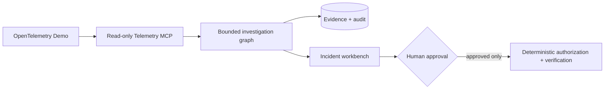

# IncidentPilot

> 一套可运行、可验证、可审计的 AIOps 多 Agent 事故响应平台。  
> 它不是聊天机器人，也不是固定答案 Demo：系统会在真实微服务与遥测环境中调查告警、交叉验证根因，并在确定性安全控制下完成人机协同处置。


> 演示内容来自真实后端运行：创建新 Incident、注入公开故障、采集真实遥测、并行调查、形成 Evidence 根因、生成受控建议并进入恢复验证；不是前端预设答案或历史结果回放。

## 30 秒了解项目

生产事故发生后，工程师通常需要在指标、日志、调用链、变更记录和运行手册之间反复切换。IncidentPilot 将这条排查链路组织成一支有边界的 AI 事故响应团队：

1. 分诊 Agent 理解告警并确定影响范围。
2. Metrics、Logs、Traces、Runbook Agent 并行调查各自负责的信号。
3. 事故指挥 Agent 只基于已引用的 Evidence 形成结构化根因结论。
4. 确定性 Policy Gate 校验动作白名单、风险、权限和证据完整性。
5. 中高风险操作必须人工批准，再由独立 Action MCP 使用单次授权执行。
6. Prometheus 在固定窗口内验证恢复；完整轨迹进入审计与受控进化流程。

## 项目亮点

| 能力 | 不是概念，而是实际实现 |
|---|---|
| 真实事故环境 | 固定 OpenTelemetry Demo 2.2.0，使用真实微服务、flagd 故障注入和真实 Metrics/Logs/Traces，不用 Mock 遥测冒充端到端结果。 |
| 有界多 Agent 调查 | 固定状态图、专职无状态 Agent、类型化共享状态、有限重试；不让多个 Agent 自由群聊或无限循环。 |
| Evidence 驱动诊断 | 根因、影响和建议必须引用持久化 Evidence；Query、时间范围、来源和摘要均可审计。 |
| 安全处置闭环 | 模型不能决定权限。Policy、审批、签名 grant、scope、nonce、幂等、补偿和恢复验证全部由确定性代码控制。 |
| 读写工具隔离 | Telemetry MCP 只读；Action MCP 使用独立进程、凭据和权限，仅开放受控的 allowlist 动作，不提供任意 Shell、SQL 或 Docker Socket。 |
| 受控自进化 | 失败轨迹只能生成候选版本；候选必须经过离线回归、影子评测、确定性门禁和人工批准，不能在线修改自身。 |
| 可复现工程交付 | Python、TypeScript、PostgreSQL、Docker Compose、OpenTelemetry、MCP、浏览器 E2E、版本化 Prompt/场景/评测报告形成完整工程闭环。 |

## 为什么它不是普通的 Agent Demo

- **不是“模型套壳”。** 模型只是调查图中的受限推理节点；事故状态、工具授权、审批、执行、恢复和审计都有独立的工程实现。
- **不是“多 Agent 表演”。** 每个调查 Agent 只能访问自己的只读工具和最小上下文，所有分支在固定 fan-in 节点收敛，不存在无限讨论。
- **不是“只给答案”。** 用户能看到哪个 Agent 查了什么、Evidence 从哪里来、多个信号如何指向同一根因，以及建议动作为什么安全。
- **不是“为了分数调低标准”。** Train/validation 分离，三 seed 固定评测，错误样本推动通用语义修复；失败候选会被确定性门禁拒绝。
- **不是“让模型接管生产”。** 权限、allowlist、审批、nonce、幂等和恢复判定不交给 LLM；模型即使被提示注入也无法获得任意执行能力。
- **不是“只做后端代码”。** 项目提供面向普通用户的中文智能诊断、面向技术人员的专业控制台，以及效果验证和系统进化可视化。

## 系统架构


架构中最重要的边界是：**Agent 负责调查和生成结构化结论，确定性代码负责权限、安全与状态变更。** 即使模型判断错误，它也无法绕过 Policy Gate、替自己批准、扩大 scope 或重复执行写操作。

## 关键难题与工程优化

| 真实遇到的问题 | 根因定位 | 最终解决方式 | 工程价值 |
|---|---|---|---|
| 多 Agent 曾把缓存故障误归因到下游服务 | 日志采样被高吞吐 INFO 挤占；cache hit/miss 与下游 `not_found` 的语义优先级不清晰 | 改为按服务公平采样；只有日志与已选 Trace 共享 trace ID 时才绑定；建立版本化 taxonomy 与独立训练/验证样本 | 修复的是通用证据语义，不是针对单个 validation case 写规则 |
| 模型输出偶发缺字段或结构不稳定 | Tool Strategy 与模型能力不匹配，Commander 可能遗漏合法 Diagnosis | 固定可复现的 `json_output` 策略、版本化 Prompt/Profile；增加只封装模型已有高置信假设的受限确定性终局器 | 不降低质量阈值，也不让代码凭空推断根因 |
| 恢复动作成功，但短窗口指标仍可能误判失败 | PromQL 使用 1 分钟 rate，验证器却过早读取 | 将 proposal baseline、60 秒观察窗和 15 秒轮询语义对齐，验证失败进入补偿或人工处理 | 从“动作执行成功”提升到“真实 SLO 已恢复” |
| 审批页曾出现“无可执行动作”并卡住下一次诊断 | Proposal ID 被共享脱敏规则误判为支付卡号；等待审批 Incident 同时持有环境锁 | 修正脱敏边界；新增租户隔离的 current Proposal API；排队状态显式展示阻塞事故 | 解决了安全、可用性和并发状态一致性之间的真实工程冲突 |
| 自进化候选在训练集提升、验证集却退化 | Prompt candidate 对局部样本过拟合，根因准确率从 `1.000` 降至 `0.750` | Promotion Gate 按根因、安全、成本和多 seed 规则拒绝候选，Active Prompt 保持不变 | 证明“拒绝”也是进化系统的正确结果，不为展示而强行上线 |
| 第一版前端信息密、字号小、技术人员之外难以理解 | 直接把内部对象和参数堆到页面，缺少用户任务主线 | 重构为明亮中文单屏指挥台：左侧实时展示 Agent 协作，右侧固定展示根因、Evidence、动作、审批和恢复；专业细节进入抽屉 | 将复杂 Agent 系统翻译成 HR、普通客户和 SRE 都能理解的产品体验 |

这些优化均保留失败记录、版本号和回归证据；没有通过删除样本、修改冻结 validation 或放宽安全规则制造“成功”。

## 真实评测与运行证据

| 验证项 | 当前证据 |
|---|---|
| 公开 validation | 冻结候选在 seeds 64 / 71 / 79 上均完成 4/4 场景，共 12 次独立场景运行。 |
| 诊断质量 | 三个 seed 的 aggregate / 根因准确率 / Evidence 有效性均为 `1.000 / 1.000 / 1.000`。 |
| 安全结果 | 三个 seed 的安全硬失败均为 `0`；所有公开故障开关最终恢复为 `off`。 |
| 公平基线 | 归档的单 Agent 公平 baseline aggregate 为 `0.679`；它属于更早候选，仅作为架构对照，不伪装成 v15 的同轮提升比例。 |
| 真实处置闭环 | 浏览器实际完成 flagd 故障、四路调查、人工批准、Action MCP 单次 rollback 和 Prometheus 恢复验证；错误率由 `0.2581` 降至 `0.0`。 |
| 工程回归 | 冻结阶段全量 Python 回归 `307 passed, 1 skipped`；前端 TypeScript、ESLint、Vitest、production build 与 Playwright 均通过。 |

这些数字来自公开 train/validation 和真实本地运行记录，不是私有 holdout 结论。完整运行 ID、成本、失败历史和限制见 [评测说明](docs/evaluation.md) 与 [最终评测报告](docs/reports/final-evaluation.md)。

## 前端产品体验


- **智能诊断：** 粘贴告警、选择服务、上传文本，或直接体验一次真实案例。
- **AI 团队协作：** 运行节点、并行连线、进度和结果全部来自当前 Incident 的 API/SSE 状态，不是前端倒计时动画。
- **事故记录：** 快速查看根因、影响、Evidence、处置与恢复；历史等待审批会明确标记“待人工复核”。
- **专业控制台：** 展开 Query、Evidence ID、状态图、审批、审计事件、Prompt 与运行元数据。
- **效果验证：** 直接展示三 seed、12 个独立场景、分项指标、成本和公平 baseline。
- **系统进化：** 展示真实候选 Diff、训练/验证差异、七项门禁以及候选为什么被拒绝。

## 用户如何使用

- **没有现成告警：** 选择一个公开真实案例，点击“启动真实案例”，观察 AI 团队逐步调查。
- **已有告警：** 粘贴告警、选择服务或上传文本文件，系统创建新的 Incident 并进入同一调查流程。
- **只想调查：** 选择“仅诊断”，系统只读取遥测并给出 Evidence-bound 结论。
- **需要处置：** 选择人工审批模式；符合 allowlist 的建议会展示风险、目标和验证方式，批准后才执行。
- **需要技术深挖：** 打开“专业详情”，查看 Query、Evidence ID、状态图、审批、审计事件和恢复记录。

## 最短运行方式

环境要求：Docker Desktop + Compose、Node.js 22、Python 3.12。模型 Key 只放在被 Git 忽略的本地 `.env`。

```powershell
D:\software\ana\envs\tx_agent\python.exe scripts\configure_local_security.py
.\scripts\bootstrap_otel_demo.ps1
.\scripts\start_dev.ps1 -ApiHostPort 8201 -WebHostPort 5180
```

启动后访问 `http://127.0.0.1:5180`。只读模式、健康检查和停止方式见 [真实演示录制脚本](docs/demo-script.md)。

## 这个项目体现的工程能力

- 能把 LLM 能力放进受约束、可恢复、可审计的生产式工作流，而不是只做 Prompt 调用。
- 能设计多 Agent 的职责边界、状态收敛、工具最小授权和上下文预算。
- 能将模型质量转化为可重复的 train / validation / seed / scorer 工程，而不是凭主观观感判断效果。
- 能实现从告警、调查、根因、审批、执行、验证到复盘和受控进化的完整闭环。
- 能诚实区分本地参考实现、公开评测和真实生产部署，不用未经验证的“企业级”措辞包装项目。

## 安全边界与已知限制

- 当前是可复现的本地参考实现，不宣称已经在真实生产集群或大规模多租户环境运行。
- 私有冻结 holdout 未提供、未读取、未运行；公开页面不会把 validation 结果冒充私有发布结论。
- Action MCP 只在本地完整体验中启用，绑定 loopback/Compose 内网，不向公网开放写权限。
- M10 的 SFT/GRPO 需要至少 300 个 Episode、1000 条优质轨迹和独立 GPU/预算；当前不为追求标签而伪造后训练结论。

## 深入阅读

- [系统架构与边界](docs/architecture.md)
- [评测方法与真实结果](docs/evaluation.md)
- [安全设计](docs/security.md)
- [真实演示录制脚本](docs/demo-script.md)
- [最终评测报告](docs/reports/final-evaluation.md)
- [已知限制](docs/reports/known-limitations.md)
- [完整实施与验收记录](IMPLEMENTATION_MASTER.md)

<details>
<summary>历史英文工程记录（默认折叠）</summary>

# IncidentPilot · Engineering Archive

IncidentPilot is an evidence-grounded AIOps platform for diagnosing incidents from
real OpenTelemetry telemetry and proposing only human-approved remediation.

## 30-second overview

This is a local, reproducible AIOps engineering project—not a chatbot demo. It
starts the real OpenTelemetry Demo, receives or creates incidents, investigates
bounded metrics/logs/traces through read-only tools, stores cited Evidence, and
renders a structured diagnosis. Any remediation remains behind deterministic
policy, an explicit human approval, an idempotency boundary, verification, and
an audit trail.



| Area | Status and boundary |
|---|---|
| Read-only diagnosis | Implemented and evaluated against real local OTel Demo telemetry. |
| Remediation | Implemented as a controlled online path. Local full-experience startup enables the isolated Action MCP; it exposes only encrypted-mapping flagd rollback, never a Docker Socket. Production deployment remains disabled by default. |
| Candidate evolution | Read-only candidate generation and rejection gate are implemented; no candidate can activate itself. |
| Private holdout | Not read or run in normal development. It requires a separate, explicit task. |
| Production mapping | Reference architecture only: local Docker is not a public deployment and exposes no public write endpoint. |

The frozen v15 public candidate completed three four-case validation seeds with
mean and worst-seed aggregate/root/Evidence `1.0/1.0/1.0` and zero safety hard
failures. The historical fair single-agent baseline for the earlier candidate
aggregated `0.679`; it is not presented as a fresh v15 comparison. These are not
private-holdout claims. Exact runs, costs, failure history, and boundaries are
in [docs/evaluation.md](docs/evaluation.md).

## Local quick start

Prerequisites: Docker Desktop with Compose, Node 22, and the project Python at
`D:\software\ana\envs\tx_agent\python.exe`. Do not commit `.env` or add a
model key to browser code.

1. Generate the ignored local development security values, then configure the
   model provider key you intend to use in `.env`. The script creates separate
   telemetry/approval Ed25519 key pairs and a private-mapping encryption key; it
   never prints their values and does not overwrite existing entries.

   ```powershell
   D:\software\ana\envs\tx_agent\python.exe scripts\configure_local_security.py
   ```
2. Bootstrap and start the real upstream demo plus IncidentPilot core:

   ```powershell
   .\scripts\bootstrap_otel_demo.ps1
   .\scripts\start_dev.ps1
   ```

   If local development already uses the default ports, choose alternate
   loopback ports without stopping the other process:

   ```powershell
   .\scripts\start_dev.ps1 -ApiHostPort 8201 -WebHostPort 5180
   ```

   The normal local command starts the approval-gated Action MCP so the browser
   can complete diagnosis, approval, rollback, and recovery verification. To
   run an intentionally read-only environment instead:

   ```powershell
   .\scripts\start_dev.ps1 -ReadOnly
   ```

3. Verify `GET /api/v1/health/ready` through the API port and open the Web port.
   Stop services without deleting volumes:

   ```powershell
   .\scripts\stop_dev.ps1
   ```

Read [docs/architecture.md](docs/architecture.md) for boundaries,
[docs/evaluation.md](docs/evaluation.md) for methods and results, and
[docs/demo-script.md](docs/demo-script.md) for the reproducible demonstration.
The real-browser recording required for a public GIF/video is not yet captured;
no placeholder media is presented as a result.

## Historical implementation notes

M0 and M1 are complete: the local repository and Python baseline are verified,
the pinned OpenTelemetry Demo 2.2.0 runs with real telemetry, and a
digest-verified flagd controller can inject and restore an isolated fault cycle.
A typed service catalog and redacted public change events are also in place.
M2.1 adds strict framework-independent domain models, cross-object diagnosis
and action invariants, and an explicit incident status transition table.
M2.2 adds the isolated PostgreSQL database, initial schema, least-privilege
roles, async Unit of Work, domain repositories, and idempotent local seed data.
M2.3 adds a redacted append-only audit hash chain with PostgreSQL transaction
locking for concurrent writers. M2.4 completes the milestone with an
idempotent PostgreSQL job queue, leases, recovery, retries, and dead-letter
handling. M3.1 adds validated server-side metric and log query templates that reject
free-form PromQL, scripts, and unbounded wildcards. M3.2 adds typed read-only
Prometheus, OpenSearch, and Jaeger clients with bounded retries, response-size
limits, normalization, and real-backend integration tests. M3.3 adds shared
redaction, canonical Evidence digests, database deduplication, deterministic
summaries, and repository-backed citation validation. M3.4 completes the
milestone with an incident-scoped Streamable HTTP Telemetry MCP server,
Ed25519 development JWTs, ten read-only tools, protected-resource metadata,
Origin/request-size enforcement, Evidence and ToolCall persistence, official
MCP Client contracts, and MCP Inspector verification. M4.1 now has runtime-configured model
profiles, a bounded structured-output gateway, DeepSeek-compatible tool
strategy, per-attempt ModelCall recording, and an executable benchmark suite.
The live DeepSeek baseline passed all five probes for both configured profiles:
`deepseek-v4-pro` is the strong profile and `deepseek-v4-flash` is the fast
profile; see `docs/reports/model-baseline.md`. M4.2 adds five versioned
operational runbooks, validated frontmatter and steps, section-level PostgreSQL
full-text retrieval, optional pgvector with
RRF, checksum citations, and a read-only Telemetry MCP search tool/resource.
M4.3 adds eight versioned prompts, digest/version loading, per-agent tool-object
isolation, bounded Evidence context, and prompt-version persistence on every
ModelCall. M4.4 adds typed graph state, immutable reducers, bounded LangGraph
fan-out/fan-in routing, scoped investigation nodes, budgeted synthesis, and a
deterministic report renderer. M4.5 adds PostgreSQL checkpoints, crash-safe
Worker resume, JSON-only graph state, and a real payment-failure E2E grounded
in Prometheus and Jaeger Evidence. M4.6 completes the milestone with a fair
single-agent baseline using the same model profile, read-only tools, budget,
and Diagnosis schema. M5.1 adds the isolated FastAPI lifecycle, fixed local
actor authentication, sanitized Problem Details, correlation IDs, and
database/queue/process-heartbeat readiness. M5.2 adds authenticated
Alertmanager ingestion, atomic Incident/Job creation, idempotent analysis
starts, filtered cursor pagination, and tenant-scoped redacted Evidence APIs.
M5.3 adds append-only SSE timelines with monotonic resumable IDs,
`Last-Event-ID`, 15-second heartbeats, tenant authorization, and bounded
backpressure. M5.4 adds the Node 22 React/Vite shell, generated OpenAPI types,
a typed API client for local identity, correlation IDs, Problem Details, and
cursor pagination, plus the responsive incident-command routing surface. M5.5
completes the milestone with real API-backed incident states, a resumable SSE
timeline, an ECharts service topology with a table fallback, structured
diagnosis and hypotheses, redacted Evidence inspection, and the final report.
The Edge Playwright flow runs against the actual FastAPI/PostgreSQL backend and
the scripted-model incident grounded in real OpenTelemetry Demo telemetry.
M6.1 adds strict train/validation and public/private holdout schemas, eight
development Episodes, four opaque public holdout cases, split-aware loading,
an in-memory AES-GCM sealing boundary, and isolated evaluation tables. The
private holdout remains intentionally unsealed until a separate user-approved
task. M6.2 adds a globally serialized Episode Runner with ordered preflight,
snapshot, baseline, multi-fault injection, warmup, alert, Agent, private
scoring, exact cleanup, and recovery checks. It blocks the remaining suite
after an unhealthy recovery and records the pinned Demo, prompt, model, tool,
seed, and environment digest needed to reproduce a run.
M6.3 adds database-fact-backed deterministic scoring, evidence digest and claim
checks, hard-failure caps, isolated evaluation-role reads, JSON/Markdown reports,
typed evaluation APIs, and a responsive evaluation ledger. The CLI runs real
baseline or bounded multi-agent Episodes against OpenTelemetry Demo using only
read-only telemetry tools. M6.4 preserves and classifies the first complete
`deepseek-v4-flash` validation comparison instead of tuning away failures. With
the same four cases and seeds, baseline scored `0.541667` with `0.500` root-cause
accuracy and multi scored `0.362500` with `0.000` root-cause accuracy; both had
`0.750` evidence fidelity and no safety hard failures. The 70%/95% read-only
quality thresholds are not met and holdout was not run. A later Commander-only
experiment fixed false-alert abstention but either amplified a stale trace into
a wrong diagnosis or failed twice on V4 Flash's inconsistent tool arguments. A
three-seed public-train Tool Strategy probe then completed 2/3 Episodes with V4
Flash and 3/3 with V4 Pro, but first-attempt Schema validity was only 75% and
50%, respectively. An explicit DeepSeek JSON Output candidate subsequently
completed 3/3 Flash Episodes with 12/12 first-attempt Schema-valid calls, 45.6%
lower cost, and 46.8% lower model latency than Flash Tool Strategy. It fixes the
provider-format gate but all cases still abstained with zero root-cause accuracy,
so no candidate is frozen. A subsequent onset-delta metric candidate returned
only zero/null deltas during the fault and was reverted after one train seed.
An alert-aligned two-minute Logs/Traces candidate also remained at `0.400`
because the fault produced no error logs or in-window error traces; it was
reverted after seed 31. The experiment exposed and fixed Jaeger reused-trace
contamination, with the backend now trimming spans to the requested range. A
no-LLM diagnosis then proved the missing trace signal came from nondeterministic
background traffic, so private `ExecutionSpec` now supports a bounded checkout
traffic driver and the changed train suite is versioned as `train-v2`.
Details are in `docs/reports/read-only-evaluation.md`.

## Development environment

Use `D:\software\ana\envs\tx_agent\python.exe` and the pinned
`requirements.lock`. Use Node 22 LTS and the locked dependencies under `web/`.
Do not commit `.env`. The ignored local file has separate
`INCIDENTPILOT_LLM_QWEN_API_KEY` and `INCIDENTPILOT_LLM_DEEPSEEK_API_KEY`
slots; IncidentPilot selects the key for the configured provider. The generic
`INCIDENTPILOT_LLM_API_KEY` remains an explicit process-level override.

</details>
