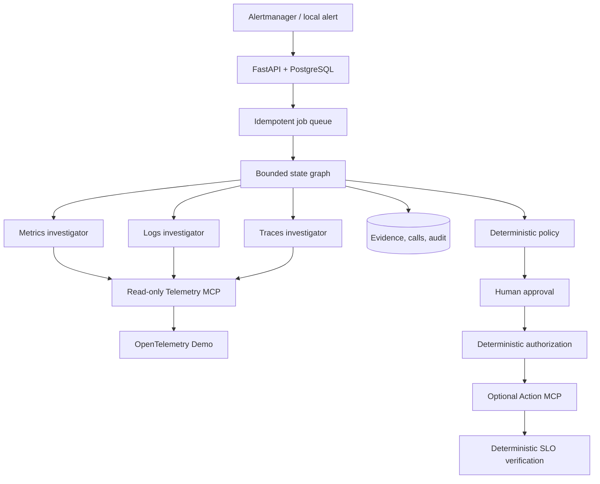

# Architecture

## Purpose and non-goals

IncidentPilot is a local AIOps reference implementation that turns bounded,
real OpenTelemetry telemetry into an evidence-cited diagnosis and a controlled
remediation proposal. It is **not a free-form agent chat**: agents do not share
unbounded conversations, do not receive a shell, arbitrary SQL, Docker socket,
or arbitrary URLs, and cannot decide whether a write is permitted.

## Runtime boundaries

The online API, worker, and telemetry MCP are separate non-root images. Their
root filesystems are read-only, temporary state is in tmpfs, and only loopback
host ports are published. The `core` Compose profile has no Docker socket and
does not start write actions. The `actions` profile is separate and currently
fails closed because a persistent private rollback mapping has not been wired
into a long-running Action MCP. The `evaluation` profile uses a separate image;
online images exclude scenarios, evaluation material, private artifacts, and
`.env`.

The local services join the upstream external `opentelemetry-demo` network only
to reach required telemetry endpoints. PostgreSQL roles separate API, worker,
telemetry MCP, action MCP, and evaluation access. Telemetry MCP gets only
read-query capabilities plus the narrowly scoped process-heartbeat upsert.

## Why decisions stay outside the model

The graph holds typed, JSON-serializable state and uses a bounded fan-out of
specialist investigators. Model output is a structured candidate, never the
source of authority. **Deterministic code** validates schemas, Evidence IDs,
tenant scope, policy prerequisites, approval grant signature and scope, nonce
consumption, idempotency, execution result, rollback, and verification.

This keeps a model error from becoming a permission error. It also allows every
decision to be reproduced from stored public facts without storing private
chain-of-thought.

## Evaluation isolation

The Episode Runner alone can inject scenarios and compare a result with hidden
truth. Online services and normal development agents cannot read, decrypt, or
search private holdout material. A frozen holdout may be used only after a
candidate and its parameters are frozen and the user explicitly requests that
task; its result cannot be used to tune the same suite.

## Production mapping

The repository is a local reference, not an internet-facing deployment. A real
deployment would replace local actor identity and development JWTs with an
enterprise identity provider, split read/write credentials in a secret manager,
run databases and queues as managed services, and place the optional Action MCP
behind network policy and an audited approval workflow. Those mappings are not
claimed to be implemented here.
